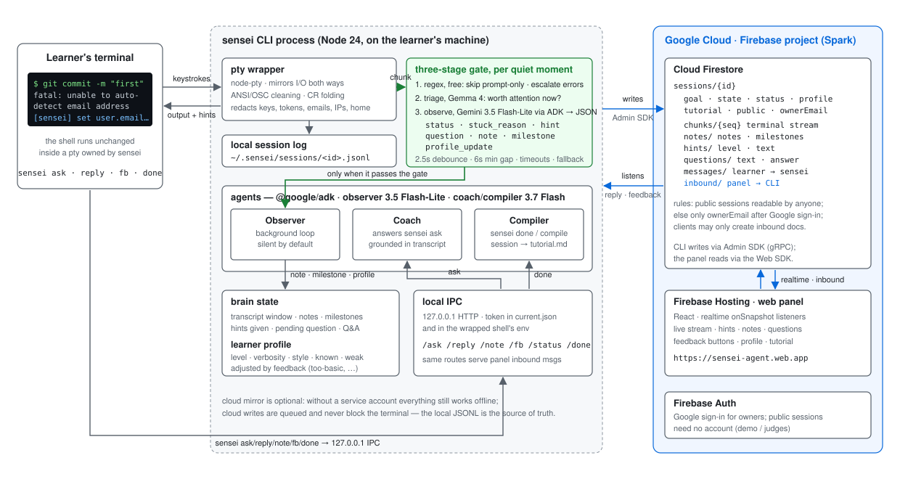

# Sensei

> A senior engineer who sits next to you while you learn a tool in the terminal — watches, waits, nudges when you're stuck, takes notes, and turns your struggle into a tutorial.

**All Things Agentic Hackathon 2026 · Collaborative Partner track**
Built with Gemini 3.7 Flash · Google ADK (TypeScript) · Cloud Firestore · Firebase Hosting

**Live panel:** https://sensei-agent.web.app  ·  Demo video: to be added at submission

<!-- TODO: demo video link at submission -->

## The friction

Learning a CLI tool (git, Docker, an MCP server, a build system…) is mostly *doing*: you type, it fails, you search, and you try again. Chat assistants sit in another window and know only what you paste. Nobody watches the actual stream or remembers what you tried, and by the time you get it working, the knowledge has evaporated.

Sensei fixes that by living **inside** the terminal session:

- `sensei start` wraps your shell. Everything you type and everything the terminal prints is captured (locally redacted first — keys, tokens, emails, home paths never leave the machine).
- A background **Observer** agent (Gemini 3.5 Flash-Lite via the Google ADK, with automatic fallback to 3.7 Flash) reads the messy stream — ANSI, stack traces, progress bars — and uses evidence to decide whether you're flowing, exploring, or stuck. It stays silent by default. When it speaks, it gives you one line, in your language, at the level you requested.
- It **asks a clarifying question** only when the right hint depends on your intent.
- It **takes notes** throughout the session (what you tried, what failed, why, and what worked) and records **feedback** (`too-basic`, `confusing`, `just-tell-me`, `let-me-try`) in a learner profile, allowing it to adapt to how you think.
- `sensei done` runs the **Compiler** agent: the entire session — commands, errors, notes, milestones, Q&A — is synthesized into a step-by-step tutorial with a "pitfalls we hit" table and a 60-second spoken script. You learned it; now you can teach it.
- **Three-stage gate** (free regex → cheap Gemma triage → Gemini Observer) keeps it silent by default; a **hint ladder** escalates nudge → direction → cause → fix as failures repeat (prompt-driven against the transcript and learner profile, guarded by a cooldown and an echo filter); and **auto-ask** — a feature our first zero-background user taught us — catches natural language typed straight into the shell and answers it as a question.
- A **web panel** (Firebase Hosting) shows the live session, hints, notes, questions, learner profile, and compiled tutorial — whether you're following along on a second screen or a mentor or reviewer is watching.

## Architecture




Details: [`docs/ARCHITECTURE.md`](docs/ARCHITECTURE.md).

Why the agent runs alongside the terminal instead of on a server: the terminal stream is the data source, and it lives on your machine. The API key stays there too. Firestore serves as the shared brain and realtime bus, while the panel is a pure Firestore client. (An optional Cloud Run deployment of the same agents is outlined below.)

## Quickstart

Requirements: Node ≥ 24, a Gemini API key, a Firebase project with Firestore (optional — without it Sensei runs fully offline and still coaches you).

> Platform notes: Sensei was developed and fully tested on **Windows 10/11 (PowerShell)**. macOS and Linux use the same node-pty layer and default to `$SHELL`. On Linux, `npm install` compiles node-pty from source, so you need Python 3, make, and a C++ toolchain (`apt install build-essential python3`). Smoke-test coverage on macOS and Linux is less extensive than on Windows — issues are welcome.

```bash
git clone https://github.com/Claude-Ovo/sensei.git && cd sensei
npm install
npm run build
npm -w @sensei/cli link          # exposes the `sensei` command
```

Configure `~/.sensei/.env`:

```
GEMINI_API_KEY=...               # required for coaching
SENSEI_LANG=en                   # hint language (default en; zh-CN also supported)
SENSEI_MODEL=gemini-3.7-flash    # default
# optional cloud mirror + web panel:
SENSEI_SERVICE_ACCOUNT=~/.sensei/service-account.json
SENSEI_OWNER_EMAIL=you@example.com
# optional: route through a local proxy
SENSEI_PROXY=http://127.0.0.1:10808
```

Run:

```bash
sensei start -g "learn git: make my first commit"
# … work in the wrapped shell as usual …
sensei ask "why does git say 'not a git repository'?"
sensei fb too-basic
sensei note "the fix was configuring user.email"
sensei done            # compiles the tutorial (also written to ~/.sensei/tutorials/)
exit
```

`sensei start --public` makes the session visible to anyone on the panel (demo mode); by default sessions are visible only to `SENSEI_OWNER_EMAIL` after Google sign-in.

## Commands

| Command | Description |
|---|---|
| `sensei start [-g goal] [--public] [--offline] [--no-agent]` | wrap your shell and start watching |
| `sensei ask "<question>"` | ask the Coach about what just happened |
| `sensei reply "<answer>"` | answer Sensei's clarifying question |
| `sensei note "<text>"` | leave a note for the tutorial |
| `sensei fb helpful\|too-basic\|confusing\|too-deep\|just-tell-me\|let-me-try` | adjust how Sensei talks to you |
| `sensei status` | show session status |
| `sensei done` | compile the session into a tutorial |

## Repository layout

```
packages/cli     the sensei CLI: pty wrapper, redaction, agents (ADK), Firestore mirror, IPC
packages/web     the panel (React + Vite + Firebase Web SDK), deployed to Firebase Hosting
docs/            architecture, plan, collaboration channel
firestore.rules  security rules (public sessions readable by anyone; owner-only otherwise; panel may only append to inbound)
```

## Deploying the panel

```bash
firebase login
firebase deploy --only firestore:rules,firestore:indexes,hosting
```

## Optional: run the agents on Cloud Run

The agent layer (`packages/cli/src/agent`, `packages/cli/src/lib/brain.ts`) is transport-agnostic; a thin Express wrapper can host it on Cloud Run and accept chunk uploads from a lightweight CLI. See `packages/server` (scaffold) — not required for the demo.

## License

MIT
